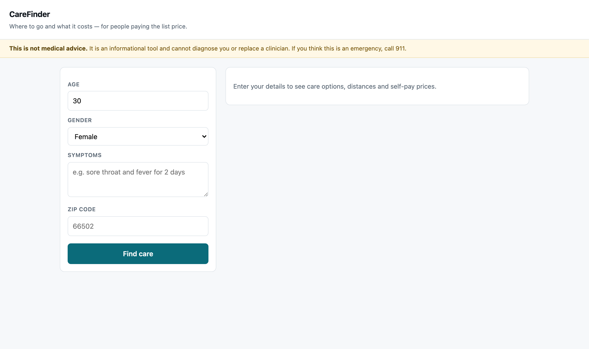
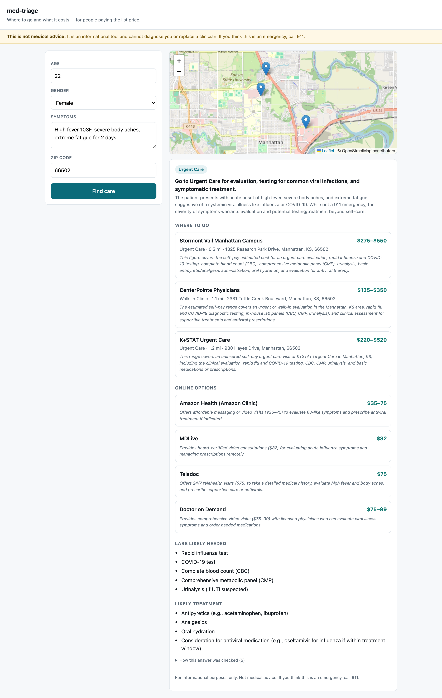
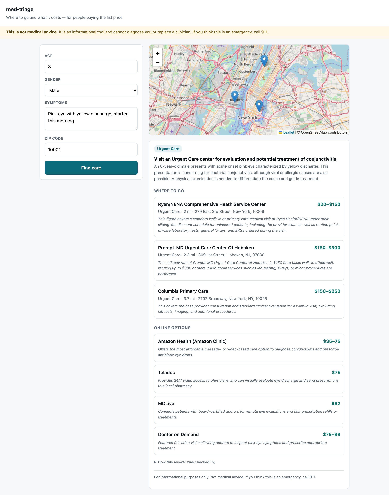
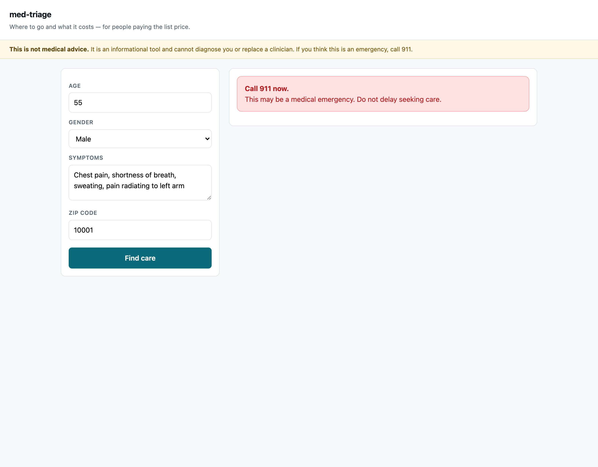
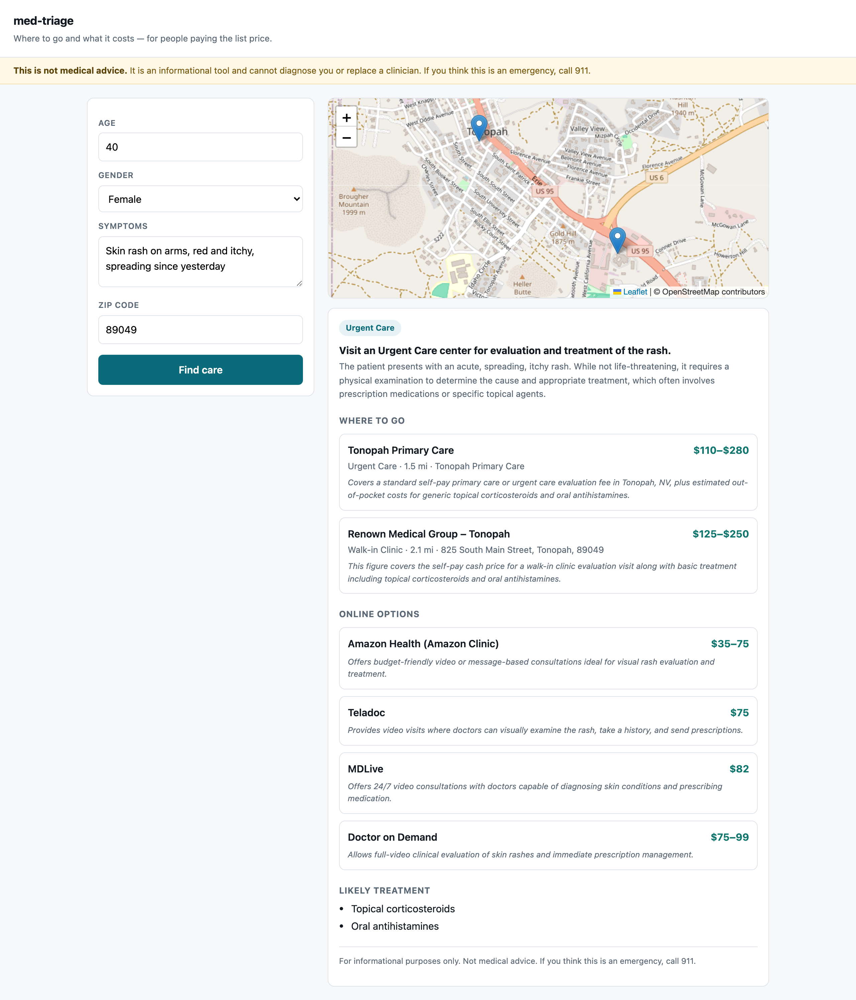
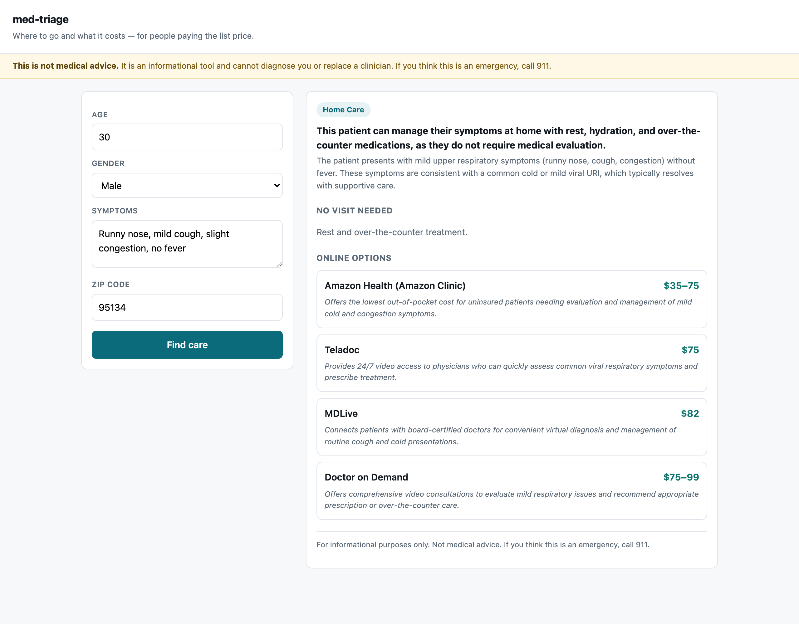

# Demo

Captured with Playwright against a live localhost server on 2026-08-18, driving a
real MedGemma 27B endpoint on Vertex AI. Every facility, price and clinical
assessment shown is genuine output. Nothing is mocked or staged.

Reproduce with:

```bash
python web/app.py                  # terminal 1
python demo/capture.py             # terminal 2
```

## Latency

| Case | Time | Why |
|---|---|---|
| Emergency | **3.1s** | The gate fires and the pipeline stops. One model call. |
| Home care | 16.0s | Two model calls, then no lookups at all. |
| Rural | 52.0s | Full pipeline over a sparse area. |
| Urgent care | 55.0s | Full pipeline: gate, assessment, search, filter, 3 concurrent price searches, review. |
| Pink eye | 68.7s | Same, with more candidate facilities to judge. |

MedGemma accounts for roughly 60 seconds of a full run — two calls at ~30s each
on a cold 27B endpoint. Pricing searches run concurrently; in series they added a
further 25s.

The emergency case at 3.1s is the shape that matters: the one path where speed is
clinically relevant is the fastest, because it does the least.

---

## 01 — Landing



The "not medical advice" notice is visible before any input, not only underneath a
result. Four fields, no insurance questions, no account.

## 02 — Urgent care



*22F, high fever 103F with body aches and fatigue, Manhattan KS.*

Three real clinics from OpenStreetMap, mapped, with real addresses. Prices are
facility-specific rather than a regional average — $135–$350 at CenterPointe
against $275–$550 at Stormont Vail — and each states what it covers, priced for
the labs the clinical model actually identified.

Four telehealth options sit below at $35–$99, each with a reason. For this
patient the cheapest correct answer is roughly a fifth of the most expensive one.

## 03 — Routine complaint



*8M, pink eye with discharge, NYC.*

Telehealth at $35–75 alongside in-person options. Pink eye is the canonical
remotely-treatable complaint, and an earlier version suppressed every online
option here because the clinical model was over-cautious about remote care.

This case also shows the system's known weakness: it routes to Urgent Care where a
retail clinic would do. See [EVALUATION.md](../docs/EVALUATION.md).

## 04 — Emergency



*55M, chest pain radiating to the left arm.*

The gate fires and everything stops — no facility search, no pricing, no
telehealth. Cost is not the question during a cardiac event. This path runs
outside the orchestration graph so no downstream failure can swallow it.

## 05 — Rural



*40F, spreading rash, Tonopah NV.*

A genuinely sparse area. The app reports what is actually there rather than
filling the gap, and the online options carry more weight as a result. An earlier
version invented "Local Urgent Care" for exactly this case.

## 06 — Home care



*30M, mild cold without fever.*

Level 1 does no lookups at all — nothing is searched, nothing is priced. The
correct answer to "where should I go" is sometimes "nowhere".

---

## A note on the screenshots

Cases 02–06 were captured while the interface still carried the project's working
name, `med-triage`. The data in them is untouched live output; only the landing
page has been recaptured under the current name.
